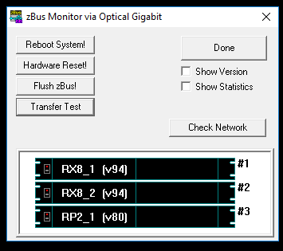
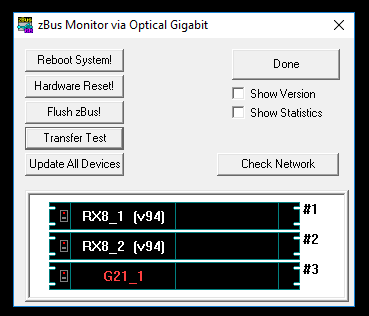
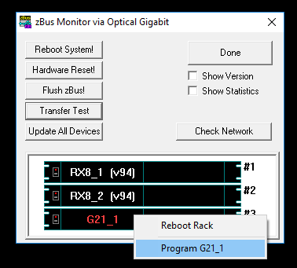
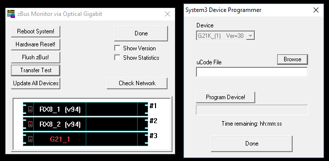

How to Debug Experiments
========================

When you are designing new experiments, the source of an error often is hard
to catch. In general there are three possible sources of error:
The python code, the circuit running on the devices, and the hardware itself.
here

Hardware
########

If you have the suspicion that there is something wrong with the devices the
first thing you should do is to open a program called "zBusmon" which monitors
the devices. This program should list all processors and the names should
be white:

Additionally, you can hit the "Transfer Test" button to check if communicating
with the devices works. If the monitor looks like the image above and the
transfer test was successful, you should probably look elsewhere for the source
of your problem. However, if a device does not show up on the monitor or it
is marked red you should try turning the devices off and on again. If the
issue persists, turn the devices off again, check the power plug and optical cable
and turn them on again. Still nothing? In this case you could do a factory reset.
In order to reset a device, you have to perform the following steps (the device
being reset is the RP2.1):

1. Connect a wire (or paper clip) from pin 12 to pin 13 on the Digital I/O port.
2. With pins 12 and 13 shorted, use the desktop shortcut to run zBUSmon.

3. In the zBUSmon utility window, hold down the shift key and right-click the device in the system diagram.
4. Click Program on the shortcut menu.

5. In the System3 Device Programmer window, select the device type (RP2).
6. Next click the Browse button next to the uCode File field and select RP21.dxe.

7. Remove the short from pins 12 and 13, and click the Program Device! button.
Do not use your computer until the device reprogramming is complete (approximately five minutes).

If you have tried all of this and your problem still persists it might be
time to contact support@tdt.com

Circuits
########

Python
######

Python
