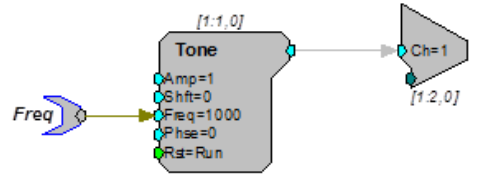

Working with TDT devices
########################

The loud speakers (and other things like response boxes or microphones) in our setup are operated using
digital signal processors from Tucker-Davis Technologies (TDT). We can look at these processors as black boxes with
defined input and output. Wile the low-level assembly code is programmed "at the factory" we can configure the devices
with circuit files which are generated with TDT's graphical programming interface. Whenever we initialize a processor
we need to specify such a circuit - here is a very simple example:

This circuit will generate a waveform that, when send to a loudspeaker, is perceived as a pure tone with frequency
1000 Hz. The tag on the left that says "Freq" is a variable that we can access via Python. This means that we can
change the frequency of the tone without opening the circuit file. If you want to understand more about programming
these circuits, check out the `documentation <https://www.tdt.com/files/manuals/RPvdsEx_Manual.pdf>`_ provided by TDT.
In :module:`freefield` the processors are handled in the :class:`Devices` class.

Initializing Devices
^^^^^^^^^^^^^^^^^^^^
As mentioned before, to initialize a device one has to specify a circuit when initializing a device (a few frequently
used circuits are stored in freefield/data/rcx/). Additionally, we have to give a name to the device and specify it's
model as well as whether the device is connected via USB or fibre optical cable.

.. code-block:: python

  from freefield import Devices, DIR  # DIR is the directory of the source code
  circuit = str(DIR/"data"/"rcx"/"play_buf.rcx")  # example circuit
  my_device = Devices()  # create a new instance
  my_device.initialize_devices(["my_RX8", "RX8", circuit])

.. _tag-guidelines:
Guidelines for Naming Tags
^^^^^^^^^^^^^^^^^^^^^^^^^^

